# TechChallengeApp on AWS ECS Cluster

This step-by-step tutorial explains how to deploy Servian TechChallenge App using Circle CI **on AWS ECS Cluster**.

This setup is very similar to the other setup in which I used an EC2 instance to deploy the Servian TechChallenge App and here is the [link](https://github.com/rsthakur83/TechChallengeApp-EC2.git) to it.

**I have tested this setup on AWS region `us-east-1` and also the terraform variable.tf file has values set as per the region `us-east-1` so i recommend to use the same region. If you want to test and deploy the resources in any other region, then it requires changes mentioned here &#10145; [**b**](#b)**.

- [Table of Contents](#table-of-contents)
  - [**CircleCI Pipeline**](#circleci-pipeline)
    - [**Prerequisites**](#prerequisites)
      - [Add environment variable in the circleci project](#add-environment-variable-in-the-circleci-project)
    - [**CircleCI Pipeline Stages**](#circleci-pipeline-stages)
      - [terraform_backend](#terraform_backend)
      - [build](#build)
      - [terraform_deploy](#terraform_deploy)
      - [app_status](#app_status)
      - [release](#release)

  - [**TechChallengeAPP Three Tier Architecture on AWS**](#techchallengeapp-three-tier-architecture-on-aws)

    Let’s go through each of the tiers:
    - [**Tier 1: Public access - Application Load balancer**](#tier-1-public-access---application-load-balancer)
    - [**Tier 2: Restricted access - ECS Containers Running in private subnet**](#tier-2-restricted-access---ecs-containers-running-in-private-subnet)
    - [**Tier 3: Restricted access - Database Running in private Subnet**](#tier-3-restricted-access---database-running-in-private-subnet)
  - [**Detail description of the Terraform code in the Three-Tier AWS Architecture**](#detail-description-of-the-terraform-code-in-the-three-tier-aws-architecture)
    - [**Prerequisites for setting up AWS Infrastructure using terraform**](#prerequisites-for-setting-up-aws-infrastructure-using-terraform)
    - [**Terraform Variables**](#terraform-variables)
    - [**Terraform State File**](#terraform-state-file)
    - [**Create a provider for AWS**](#create-a-provider-for-aws)
    - [**Create a VPC and Internet Gateway**](#create-a-vpc-and-internet-gateway)
    - [**Create a Public Subnet, Internet Gateway and Security Group**](#create-a-public-subnet-internet-gateway-and-security-group)
    - [**Create a Private Subnet, Nat Gateway, Security Group for Application**](#create-a-private-subnet-nat-gateway-security-group-for-application)
    - [**Create a Private Subnet, Security Group for RDS and launch it in Multi AZ**](#create-a-private-subnet-security-group-for-rds-and-launch-it-in-multi-az)
    - [**Create IAM Roles and Policies**](#create-iam-roles-and-policies)
    - [**ECS Task Definition**](#ecs-task-definition)
    - [**ECS Service Definition**](#ecs-service-definition)
    - [**Create and Store Encrypted Secrets in SSM Parameter Store**](#create-and-store-encrypted-secrets-in-ssm-parameter-store)
    - [**Create ECS Cluster, Launch & Auto Scaling Group Configuration and Deploy Dockerized Application on ECS Cluster**](#create-ecs-cluster-launch--auto-scaling-group-configuration-and-deploy-dockerized-application-on-ecs-cluster)
    - [**Image Tag**](#image-tag)
    - [**Create Cloudwatch Alarm and Autoscaling Group Policies**](#create-cloudwatch-alarm-and-autoscaling-group-policies)
    - [**Create Application Load Balancer, Listener and Target group**](#create-application-load-balancer-listener-and-target-group)
  - [**Access Servian App and Tag the Release**](#access-servian-app-and-tag-the-release)
  - [**Application Rolling Update Deployment**](#application-rolling-update-deployment)

## **CircleCI Pipeline**

This section explains the prerequisite of setting up ci/cd pipeline using circleci for TechchallengeApp running on AWS ECS cluster.

## **Prerequisites**

- First, create a new repository on your github account
- Secondly, clone the repository using below command on the above newly created blank repository.
```sh
git clone https://github.com/rsthakur83/TechChallengeApp-ECS.git
```
- Third, create a free circleci account, integrate it with your GitHub account to give permission/allow the access onto the newly created github repo. Once the github account integrated with circleci, and has required permission, click on set up project button as mentioned in following diagram so that build can be trigger from circleci. There are two option you will see after github authorized to/integrate with circle CI as highlighted below. One is the setup project this one we need to select to add github repo to circleci while other (`Unfollow Project`) shows already integrated project in CircleCI.
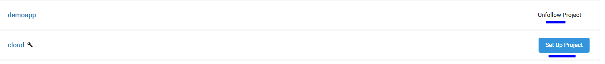
- After circleci project ready, go to the project and click on project setting option on the top right side and choose environment variables option to set all **seven environmental variables** in the project mentioned in the below diagram.
- Create AWS free tier account.
- Terraform version 0.12.0, you don't need to download it, it will be automatically get downloaded during the circleci different stages.

**Note:**

**a**)

I have found that when we add new github project in circleci, it ask for **Commit and Run** on the newly added github project. Because we have not set all the environmental variable yet for the project so i recommend here that trigger the build by choosing (`Commit and run`) then cancel it at the same time then go to the project again to set all the environmental variables mentioned in the below section.

#### b)

One more important thing if you want to deploy resources in any other AWS region than **us-east-1** then change these three values (`aws_region, availability_zone, ami_id`) as per that region in the `variable.tf` file located  in the path `./variable.tf`.

### **Add environment variable in the CircleCI project**

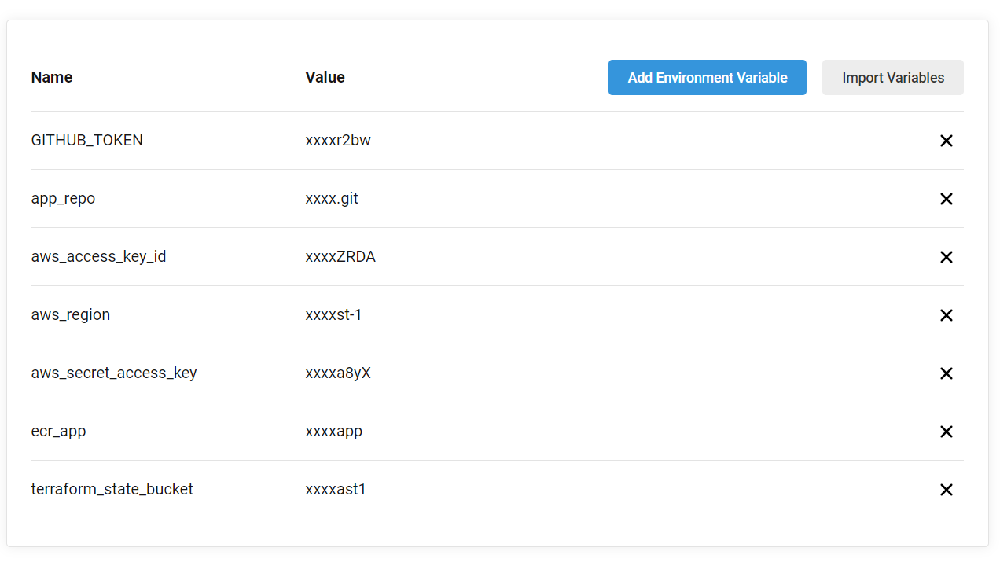
I have added the below variables using Circleci WebUI due to security reasons because some variables contains secret values such as aws access key id & secret access key id, github token which we don't want to show in github repo.

- **GITHUB_TOKEN**: Generate the github token by choosing the option personal access tokens from the github setting -> then developer setting -> Personal access tokens and give it permission to write permission as highlighed below. This token will be used to create the release on the repo.

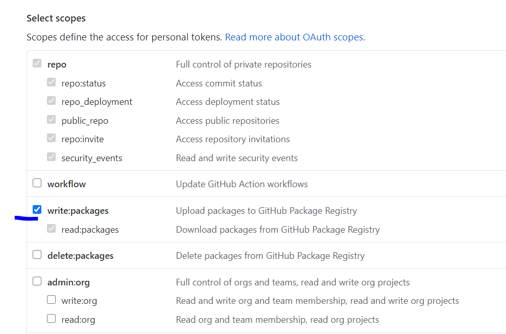

- **app_repo**: Set this variable value as (`TechCallengeApp repo link`)--> <https://github.com/servian/TechChallengeApp.git>. It will be used during the build and release stage.

- **aws_access_key_id**: Set the AWS access key ID
  
- **aws_secret_access_key**: Set the AWS Secret access key ID
  
- **aws_region**: Set the AWS region (for example us-east-1) where you want to deploy the app, other AWS resources.

- **terraform_state_bucket**: Again choose the unique S3 bucket name. This bucket will be used to store the terraform state file.

- **ecr_app**: This variable defines the name of the ECR repo and i have tested it with the name `ecr-app` so its better to keep it same.

After github repo integrated with circleci and environmental variable configured. Now its time to trigger the pipeline, to start the pipeline click on the rerun workflow from start option on the right side of the pipeline as highlighted in this diagram.

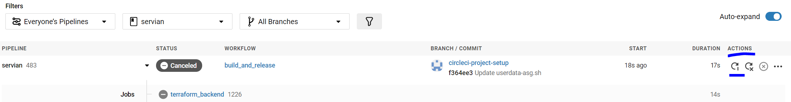

Once the pipeline starts it goes through five different stages (**terraform_backend, build, terraform_deploy, app_status, release** detail about each stage explained in below section) and will take initially the time between 20-30 min depend upon how much time multi-az RDS instance takes to reach in available state.

Successful pipeline will look something like this:

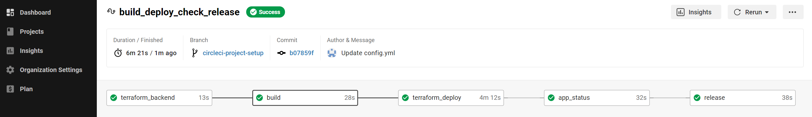

#### **CircleCI Pipeline Stages**

- #### **terraform_backend**

     In the first stage of pipeline, it creates one S3 bucket as per the environmental variable  terraform_state_bucket and one ECR repo (take the value from environmental variable `ecr_app`)

- #### **build**

   In the second (**build stage**), it downloads the code from the repo <https://github.com/servian/TechChallengeApp.git>. After that build the docker image, tag it as per the version defined in cmd/root.go file and finally push it to ECR.

- #### **terraform_deploy**

   In the third stage, which is AWS infrastructure deployment stage. It makes the change in the deploy.sh script,  and in other terraform files as per the environment variable and finally it creates the three tier infrastructure on AWS. Detail about each infrastructure component is mentioned in this section [**TechChallengeAPP three tier architecture on AWS**](#techChallengeAPP-three-tier-architecture-on-AWS).

- #### **app_status**

   In the fourth stage of the pipeline, it perform healthcheck checks on the application load balancer (ALB DNS NAME) endpoint (/healthcheck/) and expect the  OK response. In case of health check failure/unhealthy response, the pipeline will fail and will not proceed to the release stage. To get the endpoint detail we are using terraform show command as mentioned in the script `status.sh` exist under the folder `statebucket`.

- #### **release**

    As mentioned above only after the fourth stage is successful, the last and the fifth stage will be executed. This stage creates a release, pre-release based on the version mentioned in the root.go file.

## **TechChallengeAPP Three Tier Architecture on AWS**

  I have used terraform to create the below mentioned three tier infrastructure on AWS.

  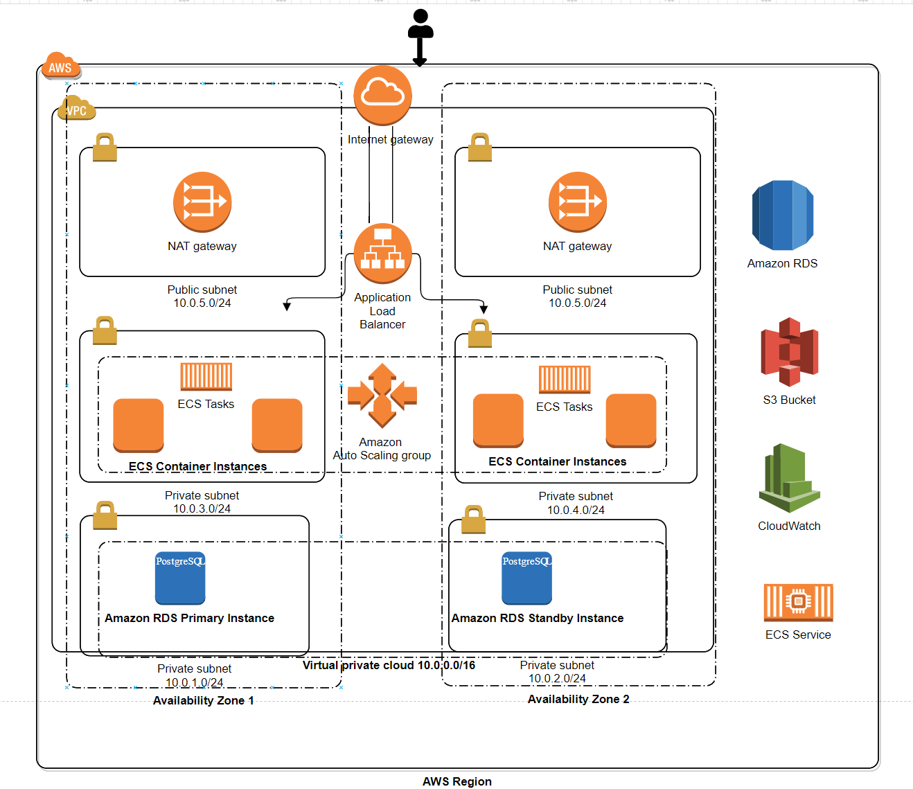

### **Tier 1: Public access - Application Load balancer**

Tier1 is publicly accessible and it has two subnets(ip address range 10.0.5.0/24 & 10.0.6.0/24) spread across two availability zone (us-east-1a, us-east-1b). Application load balancer (ALB) gets deployed in a public subnet so that end user can access application from internet. To achieve high availability for the application two NAT gateway will also be get deployed in each of these public subnets. Application load balancer listens on a port 80 and forwards the traffic to the backend containers running on ec2 instances in tier2 at port 3000. Application load balancer target group configured to perform a health check of backend at port 3000 on the path /healthcheck/.

### **Tier 2: Restricted access - ECS Containers Running in private subnet**

Tier2 also consists of two private subnets (IP address range 10.0.3.0/24 & 10.0.4.0/24) with a NAT gateway attached to the routes associated with these subnets so that instances running in the private subnet can reach the internet. Application instances running in the private subnets are managed/launched under the autoscaling group. Cloudwatch monitoring enabled and configured for scale Out & scale In of the instance and containers based on CPU metrics. These instances registered themselves under the target group which is attached to the ALB. Application security group ingress rule on the private subnet allows only traffic from the load balancer security group at port 3000.

### **Tier 3: Restricted access - Database Running in private Subnet**
  
Tier3 is the last tier in the architecture, in this tier database instances reside and running in a multi-AZ environment. This tier also spread across two availability zone, the master is running in one zone while the standby is running on another zone which will take over in case of primary DB fails. Private subnet range for this tier is 10.0.1.0/24 & 10.0.2.0/24. DB Security group ingress rule only allows traffic from the application security group at port 5432.

# **Detail description of the Terraform code in the Three-Tier AWS Architecture**

### **Prerequisites for setting up AWS Infrastructure using terraform**

- Already mentioned in the above section [**prerequisites**](#prerequisites)

### **Terraform Variables**

Terraform variable file located under the root folder `variable.tf` and following is detailed description of each variable. Most of the variables are self explanatory.

- `aws_region`: AWS region
- `service_name`: ECS application service name
- `task_family`: ECS Task family, used in ECS task definition
- `aws_region`: AWS region we want to deploy the resources
- `availability_zone`: Availability zones for example us-east-1a, us-east-1b
- `app_vpc`: VPC name
- `app_vpc_network_cidr`: VPC network CIDR
- `aws_pub_subnet_1_cidr`: Tier1/Public tier subnet1 range
- `aws_pub_subnet_2_cidr`: Tier1/Public tier subnet2 range  
- `aws_app_subnet_1_cidr`: Tier2/App tier subnet1 range
- `aws_app_subnet_2_cidr`: Tier2/App tier subnet2 range  
- `aws_db_subnet_1_cidr`:  Tier3/DB tier subnet1 range
- `aws_db_subnet_2_cidr`:  Tier3/DB tier subnet2 range
- `ami_id`: AMI Image ID
- `max_instance_size`: Max number of ec2 instances in ECS Cluster
- `min_instance_size`: Minimum number of ec2 instances in ECS cluster
- `desired_capacity`: Desired number of ec2 instance in ECS cluster
- `asg_name`: Autoscaling Group Name
- `evaluation_periods`: Evaluation period before trigger autoscaling policy
- `period_down`: Evaluation period for scaling down
- `period_up`: Evaluation period for scaling down
- `threshold_up`: Threshold value for scaling up
- `threshold_down`: Threshold value for scaling down
- `statistic`: Statistics to monitor to trigger alarms
- `min_capacity`: Instance Minimum Capacity of ec2 instance in ECS cluster
- `max_capacity`: Instance Maximum Capacity of ec2 instance in ECS cluster
- `lowerbound`: Metrics Lower interval
- `upperbound`: Metrics Upper interval
- `scale_up_adjustment`: Scaling up count for instance, container
- `scale_down_adjustment`: Scaling down count for instance, container
- `datapoints_to_alarm_up`: Number of datapoint to monitor to trigger alarm up
- `datapoints_to_alarm_down`: Number of datapoint to monitor to trigger alarm down
- `db_user`: Database user
- `db_class`: Database instance/class type
- `db_name`: Database name to create
- `db_engine`: Database engine type (example, mysql, postgresql etc..)
- `db_engine_version`: Database version number
- `db_identifier`: Unique database name
- `storage_encrypted`: Storage encryption option true or false
- `maintenance_window`: Database maintenance window time period
- `backup_window`: Database backup window
- `enabled_cloudwatch_logs_exports`: Enable cloudwatch logging for database
- `backup_retention_period`: Backup retention duration, we can set between 0 to 35
- `skip_final_snapshot`: This option is to skip the final snapshot when database deleted default is false.
- `deletion_protection`: Deletion protection, for production set it to true
- `multi_az`: RDS instance deployed with multi-AZ option provide high availability

### **Terraform State File**

Terraform state file will be stored in the S3 bucket (`as per the circleci project environment variable -> terraform_state_bucket`) which will be created during the first stage (`terraform_backend`) of the pipeline. This state file will be used in later stage (`app_status`) to check the ALB dns name to perform healtheck of the endpoint (/healthcheck/) also it is good practice to store state file outside local environment such as S3, dynamodb, consul etc.

```sh
# Terraform S3 backend to store state file
terraform {
  backend "s3" {
    bucket = "terraform_state_bucket"
    key    = "terraform.tfstate"
    region = "aws-region"
  }
}
```

### **Create a provider for AWS**

Provider file (`provider.tf`) exist under the root path of repo. AWS region value will be updated as per the value set in variable.tf.

```sh
provider "aws" {
  region = var.aws_region
}
```

### **Create a VPC and Internet Gateway**

To build the whole infrastructure for the application, first, we need to create the VPC. Here we will create a VPC with the CIDR range of 10.0.0.0/16. Then create the internet gateway which provides connectivity to the internet and attached it to the vpc. Set the DNS option as default to `AmazonProvidedDNS` which is provided AWS but it can be configured to custom DNS value as well and finally associate it to vpc.

- **`aws_vpc.app_vpc`**: This resouces will create vpc and we just configured the CIDR range and enabled dns.
- **`aws_internet_gateway.app_igw`:** Defines an internet gateway to be used by the public subnet and the NAT for the private subnets.
- **`aws_vpc_dhcp_options.dns_resolver and aws_vpc_dhcp_options_association.dns_resolver`:** Defines the DNS server for our VPC. We will use the amazon provided DNS for simplicity but you can add any other DNS ip here. Finally we associate the DNS configuration with our app_vpc resource.
  
```sh
#### VPC
resource "aws_vpc" "app_vpc" {
  cidr_block           = var.app_vpc_network_cidr
  enable_dns_support   = true
  enable_dns_hostnames = true
  tags = {
    Name = "Servian App ECS VPC"
  }
}

### Internet Gateway
resource "aws_internet_gateway" "app_igw" {
  vpc_id = aws_vpc.app_vpc.id
  tags = {
    Name = "Servian APP VPC Internet Gateway"
  }
}

#### dhcp options
resource "aws_vpc_dhcp_options" "dns_resolver" {
  domain_name_servers = ["AmazonProvidedDNS"]
}

#### Associate dhcp with vpc
resource "aws_vpc_dhcp_options_association" "dns_resolver" {
  vpc_id          = aws_vpc.app_vpc.id
  dhcp_options_id = aws_vpc_dhcp_options.dns_resolver.id
}
```

### **Create a Public Subnet, Internet Gateway and Security Group**

In the VPC, Tier1 has two public subnets (`pub_subnet_1 (10.0.5.0/24), pub_subnet_2 (10.0.6.0/24)`) as mentioned in the above AWS architect diagram and both these subnets has access to internet via internet gateway. Let discuss in detail each of these resource and how it is been associated with each other. As the application load balancer will be launched in the public subnet we are using security group to allow traffic at port 80 from outside world.

- `aws_subnet.pub_subnet_1`: This resource will create public subnet1 (IP address range 10.0.5.0/24) in availability zone us-east-1a
- `aws_subnet.pub_subnet_2`: This resource will create public subnet2 (IP address range 10.0.6.0/24) in availability zone us-east-1b
- `aws_route_table.public-routes`: This resource will create public routes which has internet gateway attached to it
- `aws_route_table_association.public-subnet-routes-1`: This resource will associate the above created routing table (public-routes) with the subnet 1
- `aws_route_table_association.public-subnet-routes-2`:This resource will associate the above created routing table (public-routes) with the subnet 2
- `aws_security_group.lb_asg`: This resource create the security group which allow only traffic at port 80 of the applicaiton load balancer from the internet

```sh
#### Public Subnet 1
resource "aws_subnet" "pub_subnet_1" {
  vpc_id            = aws_vpc.app_vpc.id
  cidr_block        = var.aws_pub_subnet_1_cidr
  availability_zone = var.availability_zone[0]
  tags = {
    Name = "Public Subnet 1"
  }
}

#### Public Subnet 2
resource "aws_subnet" "pub_subnet_2" {
  vpc_id            = aws_vpc.app_vpc.id
  cidr_block        = var.aws_pub_subnet_2_cidr
  availability_zone = var.availability_zone[1]
  tags = {
    Name = "Public Subnet 2"
  }
}

##### Route with internet gateway attached

resource "aws_route_table" "public-routes" {
  vpc_id = aws_vpc.app_vpc.id
  route {
    cidr_block = "0.0.0.0/0"
    gateway_id = aws_internet_gateway.app_igw.id
  }
  tags = {
    Name = "RT Internet Gateway"
  }
}

##### Route table association with Public Subnet 1

resource "aws_route_table_association" "public-subnet-routes-1" {
  subnet_id      = aws_subnet.pub_subnet_1.id
  route_table_id = aws_route_table.public-routes.id
}

##### Route table association with Public Subnet 2

resource "aws_route_table_association" "public-subnet-routes-2" {
  subnet_id      = aws_subnet.pub_subnet_2.id
  route_table_id = aws_route_table.public-routes.id
}

#### Load Balancer Security Group
resource "aws_security_group" "lb_asg" {
  description = "Allow HTTP  Traffic from Internet to Load Balancer"
  vpc_id = aws_vpc.app_vpc.id
  
  ingress {
    protocol  = -1
    self      = true
    from_port = 0
    to_port   = 0
  }


  ingress {
    from_port   = 80
    to_port     = 80
    protocol    = "tcp"
    cidr_blocks = ["0.0.0.0/0"]
  }

  egress {
    from_port   = 0
    to_port     = 0
    protocol    = "-1"
    cidr_blocks = ["0.0.0.0/0"]
  }
  tags = {
    Name = "ALB SG"
  }
}
```

### **Create a Private Subnet, Nat Gateway, Security Group for Application**

In the Application Tier (Tier2) we are also going to create two private subnets (`app_subnet_1 (10.0.3.0/24), app_subnet_2 (10.0.4.0/24)`) in the two availability zones and both these subnets has NAT Gateway attached to it so that the instances, containers can reach the internet. In order to provide the restricted access to this tier only traffic from the load balancer security group at port 3000 is allowed.

- `aws_subnet.app_subnet_1`: This resource will create public subnet1 (IP address range 10.0.3.0/24) in availability zone us-east-1a
- `aws_subnet.app_subnet_2`: This resource will create public subnet1 (IP address range 10.0.4.0/24) in availability zone us-east-1b
- `aws_eip.nat-eip`: This resources create the Elastic ip address required by NAT Gateway
- `aws_eip.nat-eip-2`: This resources create the Elastic ip address required by the second NAT Gateway
- `aws_nat_gateway.nat-gw`: This resources created the NAT Gateway
- `aws_nat_gateway.nat-gw1`: This resources created the second NAT Gateway
- `aws_route_table.app-subnet-routes`: This resource will create the route table which has 1st NAT gateway attached to it
- `aws_route_table.app-subnet-routes-2`: This resource will create the second route table which has 2nd NAT gateway attached to it
- `aws_route_table_association.app-subnet1-routes`: This resource will associate the route table created in previous step to app_subnet_1
- `aws_route_table_association" "app-subnet2-routes`: This resource will associate the route table created in previous step to app_subnet_2
- `aws_security_group.app_asg`: This resource will create application security group (APP SG)
- `aws_security_group_rule.app_lb_ingress_rule`: This resource will create the ingress rule for app_asg security group to allow traffic only from load balancer security group (lb_asg) at port 3000

```sh
#### APP Subnet 1
resource "aws_subnet" "app_subnet_1" {
  vpc_id            = aws_vpc.app_vpc.id
  cidr_block        = var.aws_app_subnet_1_cidr
  availability_zone = var.availability_zone[0]
  tags = {
    Name = "APP Subnet 1"
  }

}

#### APP Subnet 2
resource "aws_subnet" "app_subnet_2" {
  vpc_id            = aws_vpc.app_vpc.id
  cidr_block        = var.aws_app_subnet_2_cidr
  availability_zone = var.availability_zone[1]
  tags = {
    Name = "APP Subnet 2"
  }
}

##### EIP for NAT Gateway 1
resource "aws_eip" "nat-eip" {
  vpc        = true
  depends_on = ["aws_internet_gateway.app_igw", "aws_vpc_dhcp_options_association.dns_resolver"]
  tags = {
    Name = "Nat Gateway EIP"
  }
}


##### NAT Gateway 1 configuration for private subnets
resource "aws_nat_gateway" "nat-gw" {
  allocation_id = aws_eip.nat-eip.id
  subnet_id     = aws_subnet.pub_subnet_1.id
  depends_on    = ["aws_internet_gateway.app_igw"]
  tags = {
    Name = "Nat Gateway 1"
  }
}

##### EIP for NAT Gateway 2
resource "aws_eip" "nat-eip-2" {
  vpc        = true
  depends_on = ["aws_internet_gateway.app_igw", "aws_vpc_dhcp_options_association.dns_resolver"]
  tags = {
    Name = "Nat Gateway EIP 2"
  }
}

##### NAT Gateway 2 configuration for private subnets
resource "aws_nat_gateway" "nat-gw1" {
  allocation_id = aws_eip.nat-eip-2.id
  subnet_id     = aws_subnet.pub_subnet_2.id
  depends_on    = ["aws_internet_gateway.app_igw"]
  tags = {
    Name = "Nat Gateway 2"
  }
}


##### Route Table with NAT gateway 1
resource "aws_route_table" "app-subnet-routes" {
  vpc_id = aws_vpc.app_vpc.id
  route {
    cidr_block     = "0.0.0.0/0"
    nat_gateway_id = aws_nat_gateway.nat-gw.id
  }

  tags = {
    Name = "RT NAT Gateway 1"
  }
}

##### Route Table with NAT gateway 2

resource "aws_route_table" "app-subnet-routes-2" {
  vpc_id = aws_vpc.app_vpc.id
  route {
    cidr_block     = "0.0.0.0/0"
    nat_gateway_id = aws_nat_gateway.nat-gw1.id
  }

  tags = {
    Name = "RT NAT Gateway 2"
  }
}

##### Route Table Association with APP subnet 1

resource "aws_route_table_association" "app-subnet1-routes" {
  subnet_id      = aws_subnet.app_subnet_1.id
  route_table_id = aws_route_table.app-subnet-routes.id
}

##### Route Table Association with APP subnet 2

resource "aws_route_table_association" "app-subnet2-routes" {
  subnet_id      = aws_subnet.app_subnet_2.id
  route_table_id = aws_route_table.app-subnet-routes-2.id
}

##### APP Security Group

resource "aws_security_group" "app_asg" {
  name        = "APP Security Group"
  description = "Allow HTTP from Load Balancer"
  vpc_id      = aws_vpc.app_vpc.id


  egress {
    from_port   = 0 # need to address
    to_port     = 65535
    protocol    = "tcp"
    cidr_blocks = ["0.0.0.0/0"]
  }

  tags = {
    Name = "APP SG"
  }

}

## SG ingress rule for Application Load balancer

resource "aws_security_group_rule" "app_lb_ingress_rule" {
  type                     = "ingress"
  from_port                = 3000
  to_port                  = 3000
  protocol                 = "tcp"
  security_group_id        = aws_security_group.app_asg.id
  source_security_group_id = aws_security_group.lb_asg.id
}
```

### **Create a Private Subnet, Security Group for RDS and launch it in Multi AZ**

In the database Tier (Tier3), again we are going to create two private subnets (In two availability zones) (`db_subnet_1 (10.0.1.0/24, db_subnet_2 (10.0.2.0/24)`) for RDS database with no access to internet and can only be accessible from application security group (`APP SG`) at port 5432. Following is the detail of the resources terraform will create as per the below .tf file.

- `aws_subnet.db_subnet_1`: This resource will create public subnet1 (IP address range 10.0.1.0/24) in availability zone us-east-1a
- `aws_subnet.db_subnet_2`: This resource will create public subnet1 (IP address range 10.0.2.0/24) in availability zone us-east-1b
- `aws_db_subnet_group.db_subnet`: This resource will create subnet group is required during the lauch of RDS instance, and RDS instance will be launched in these private subnets. As we are deploying multi AZ RDS instance so in this case primary instance will be in one az while the standy will get deployed in other az .
- `aws_security_group.db`: This resource will only allow connectivity from application security group (app_asg) at port 5432

```sh
#### DATABASE SUBNET 1
resource "aws_subnet" "db_subnet_1" {
  vpc_id     = aws_vpc.app_vpc.id
  cidr_block = var.aws_db_subnet_1_cidr
  tags = {
    Name = "DB subnet 1"
  }
  availability_zone = var.availability_zone[0]
}

#### DATABASE SUBNET 2
resource "aws_subnet" "db_subnet_2" {
  vpc_id     = aws_vpc.app_vpc.id
  cidr_block = var.aws_db_subnet_2_cidr
  tags = {
    Name = "DB subnet 2"
  }
  availability_zone = var.availability_zone[1]
}

#### Create DB subnet group
resource "aws_db_subnet_group" "db_subnet" {
  name       = "app_db_subnet_group"
  subnet_ids = [aws_subnet.db_subnet_1.id, aws_subnet.db_subnet_2.id]
  tags = {
    Name = "App DB"
  }
}

#### Database instance provisioning

resource "aws_db_instance" "app_db" {
  identifier                      = var.db_identifier
  instance_class                  = var.db_class
  allocated_storage               = 20
  engine                          = var.db_engine
  name                            = var.db_name
  password                        = random_password.password.result
  username                        = var.db_user
  engine_version                  = var.db_engine_version
  db_subnet_group_name            = aws_db_subnet_group.db_subnet.name
  vpc_security_group_ids          = [aws_security_group.db.id]
  storage_encrypted               = var.storage_encrypted
  maintenance_window              = var.maintenance_window
  backup_window                   = var.backup_window
  enabled_cloudwatch_logs_exports = var.enabled_cloudwatch_logs_exports
  backup_retention_period         = var.backup_retention_period
  skip_final_snapshot             = var.skip_final_snapshot
  deletion_protection             = var.deletion_protection
  multi_az                        = var.multi_az

  tags = {
    Name = "APP DB"

  }
}

#### Database Security Group

resource "aws_security_group" "db" {
  name   = "Database Security Group"
  vpc_id = aws_vpc.app_vpc.id

  # Egress to everyone
  egress {
    from_port   = 0
    to_port     = 0
    protocol    = "-1"
    cidr_blocks = ["0.0.0.0/0"]
  }
  tags = {
    Name = "DB SG"
  }
}

### Allow connection from APP Security Group
resource "aws_security_group_rule" "db_app_ingress_rule" {
  type                     = "ingress"
  from_port                = 5432
  to_port                  = 5432
  protocol                 = "tcp"
  security_group_id        = aws_security_group.db.id
  source_security_group_id = aws_security_group.app_asg.id
}
```

### **Create IAM Roles and Policies**

We need to create IAM instance profile, IAM role, IAM policies and attached it to the launch config so that ECS container can fetch values from SSM parameter store, assume role for EC2, ECS auto-scaling, attaching policies to the roles. Following is the IAM role, Policies resource details.

- `aws_iam_role.ecs_instance_role`: This resource will create IAM role for ecs instance and has trust relationship of ec2.amazonaws.com.
- `aws_iam_role.ecs_autoscale_role`: This resource will create IAM role for ecs service scaling and has trust relationship of application-autoscaling.amazonaws.com.
- `aws_iam_role_policy_attachment.ecs_instance_role-attachment`: This resource will attach the resource ecs_instance_role to policy arn `arn:aws:iam::aws:policy/service-role/AmazonEC2ContainerServiceforEC2Role`.
- `aws_iam_role_policy_attachment.ecs_autoscale`: This resource will attach the resource ecs_autoscale to policy arn `arn:aws:iam::aws:policy/service-role/AmazonEC2ContainerServiceAutoscaleRole`
- `aws_iam_role_policy_attachment.ecs_cloudwatch`:  This resource will attach the resource ecs_cloudwatch to policy arn `arn:aws:iam::aws:policy/CloudWatchReadOnlyAccess` and allow cloudwatch readonly access.
- `aws_iam_instance_profile.ecs-instance-profile`: This resource will create the iam instance profile which is used in launch configuration.
- `aws_iam_role.ecs_service_role`: This resource will create IAM role for ecs service and has trust relationship of ecs.amazonaws.com.
- `aws_iam_policy.policy`: This resource will create IAM poilcy for a ECS task execution and SSM parameter so that ecs task can read value from SSM parameter.
- `aws_iam_role.ecsTaskExecutionRole`: This resource will create IAM Role with trust relationship of ecs.amazonaws.com, ec2.amazonaws.com, ecs-tasks.amazonaws.com.
- `aws_iam_role_policy_attachment.task_definition_policy_attach`: This resource will attach the IAM role ecsTaskExecutionRole with policy (`aws_iam_policy.policy`) arn.

```sh
### IAM Role
resource "aws_iam_role" "ecs_instance_role" {
  name               = "ecs_instance_role"
  path               = "/"
  assume_role_policy = data.aws_iam_policy_document.ecs-instance-policy.json
  tags = {
    Name = "IAM Role App"
  }
}

resource "aws_iam_role" "ecs_autoscale_role" {
  name = "ecs_scale_ecs_cluster_appecsservice"

  assume_role_policy = <<EOF
{
  "Version": "2012-10-17",
  "Statement": [
    {
      "Action": "sts:AssumeRole",
      "Principal": {
        "Service": "application-autoscaling.amazonaws.com"
      },
      "Effect": "Allow"
    }
  ]
}
EOF
  tags = {
    Name = "IAM Role App Autoscaling"
  }

}

data "aws_iam_policy_document" "ecs-instance-policy" {
  statement {
    actions = ["sts:AssumeRole"]

    principals {
      type = "Service"
      identifiers = ["ec2.amazonaws.com"]
    }
  }
}


#### IAM Role Policy Attachment

resource "aws_iam_role_policy_attachment" "ecs_instance_role-attachment" {
  role = aws_iam_role.ecs_instance_role.name
  policy_arn = "arn:aws:iam::aws:policy/service-role/AmazonEC2ContainerServiceforEC2Role"
}

#### IAM Role Policy Attachment
resource "aws_iam_role_policy_attachment" "ecs_autoscale" {
  role = aws_iam_role.ecs_autoscale_role.id
  policy_arn = "arn:aws:iam::aws:policy/service-role/AmazonEC2ContainerServiceAutoscaleRole"
}

resource "aws_iam_role_policy_attachment" "ecs_cloudwatch" {
  role = aws_iam_role.ecs_autoscale_role.id
  policy_arn = "arn:aws:iam::aws:policy/CloudWatchReadOnlyAccess"
}


resource "aws_iam_instance_profile" "ecs-instance-profile" {
  name = "ecs-instance-profile"
  path = "/"
  role = aws_iam_role.ecs_instance_role.name
  provisioner "local-exec" {
    command = "sleep 10"
  }
}

#### IAM Role

resource "aws_iam_role" "ecs_service_role" {
  name               = "ecs_service_role"
  path               = "/"
  assume_role_policy = data.aws_iam_policy_document.ecs-service-policy.json
  tags = {
    Name = "IAM Role ECS Service"
  }

}

#### IAM Role Policy Attachment
resource "aws_iam_role_policy_attachment" "ecs_service_role-attachment" {
  role       = aws_iam_role.ecs_service_role.name
  policy_arn = "arn:aws:iam::aws:policy/service-role/AmazonEC2ContainerServiceRole"
}

data "aws_iam_policy_document" "ecs-service-policy" {
  statement {
    actions = ["sts:AssumeRole"]

    principals {
      type        = "Service"
      identifiers = ["ecs.amazonaws.com"]
    }
  }
}

resource "aws_iam_role" "ecsTaskExecutionRole" {
  name = "ecsTaskExecutionRole"

  assume_role_policy = <<EOF
{
  "Version": "2012-10-17",
  "Statement": [
    {
      "Effect": "Allow",
      "Principal": {
        "Service": [
          "ecs.amazonaws.com",
          "ec2.amazonaws.com",
          "ecs-tasks.amazonaws.com"
        ]
      },
      "Action": "sts:AssumeRole"
    }
  ]
}
EOF

  tags = {
    Name = "IAM Role for App"
  }
}

resource "aws_iam_policy" "policy" {
  name = "ecs_task_execution_policy"
  description = "A ECS task execution & SSM parameter"

  policy = <<EOF
{
    "Version": "2012-10-17",
    "Statement": [
        {
            "Effect": "Allow",
            "Action": [
                "ecr:GetAuthorizationToken",
                "ecr:BatchCheckLayerAvailability",
                "ecr:GetDownloadUrlForLayer",
                "ecr:BatchGetImage",
                "logs:CreateLogStream",
                "logs:PutLogEvents"
            ],
            "Resource": "*"
        },
        {
            "Effect": "Allow",
            "Action": "ssm:GetParameter",
            "Resource": "arn:aws:ssm:*:*:parameter/*"
        },
        {
            "Effect": "Allow",
            "Action": [
                "ssm:Describe*",
                "ssm:Get*",
                "ssm:List*"
            ],
            "Resource": "*"
        }
    ]
}
EOF
tags = {
 Name = "Custom Policy for ECS Task Execution - SSM Parameter"
}

}

# IAM policy attachement to IAM role (ecsTaskExecutionRole)
resource "aws_iam_role_policy_attachment" "task_definition_policy_attach" {
  role       = aws_iam_role.ecsTaskExecutionRole.name
  policy_arn = aws_iam_policy.policy.arn

}
```

### **ECS Task Definition**

A task definition is a set of instructions that tells Amazon ECS how to run Docker containers within a cluster. Task definition specify the number of tasks to run on the cluster. The Amazon ECS task scheduler is responsible for placing tasks within the cluster. Here we are using task definition named as `app` to create the containers in ECS cluster and the container environmental variables (such as **VTT_DBHOST, VTT_DBPASSWORD, VTT_DBNAME, VTT_DBUSER**) fetched from SSM parameter store values (`dbhostname, dbpassword, dbname, dbusername`). Servian app container listen on port 3000 and also the EC2 container host listen on port 3000. Below is the task definition resource details.

- `aws_ecs_task_definition.app`: This resource will create ecs task definition which defines the container and host port along with the SSM parameter store values.

```sh
data "aws_ecs_task_definition" "app" {
  task_definition = aws_ecs_task_definition.app.family
}

data "aws_iam_role" "ecs_task_execution_role" {
  name = "ecsTaskExecutionRole"
}
resource "aws_ecs_task_definition" "app" {

  depends_on            = ["aws_db_instance.app_db"]
  family                = "app"
  execution_role_arn    = data.aws_iam_role.ecs_task_execution_role.arn
  container_definitions = <<DEFINITION
[
  {
    "name": "app",
    "image": "account-id.dkr.ecr.aws-region.amazonaws.com/ecr-repo:release-number",
    "essential": true,
    "secrets": [
        {
          "name": "VTT_DBHOST",
          "valueFrom": "arn:aws:ssm:aws-region:account-id:parameter/dbhostname"
        },
        {
          "name": "VTT_DBPASSWORD",
          "valueFrom": "arn:aws:ssm:aws-region:account-id:parameter/dbpassword"
        },
        {
          "name": "VTT_DBNAME",
          "valueFrom": "arn:aws:ssm:aws-region:account-id:parameter/dbname"
        },
        {
          "name": "VTT_DBUSER",
          "valueFrom": "arn:aws:ssm:aws-region:account-id:parameter/dbusername"
        }
    ],
    "portMappings": [
      {
        "containerPort": 3000,
        "hostPort": 3000
      }
    ],
    "memory": 100,
    "cpu": 10
  }
]
DEFINITION
  tags = {
    Name = "APP ECS Service Task Definition"
  }
}
```

### **ECS Service Definition**

ECS service definition defines long running tasks of the same Task Definition. This can be 1 running container or multiple running containers all using the same Task Definition. In our case, ecs service definition terraform file defines the container port (`3000`) , its name and cluster id, iam service role.

- `aws_ecs_service.app_ecs_service`: This resource will create ecs service with the desired count of application task running on ECS cluster.

```sh
resource "aws_ecs_service" "app_ecs_service" {
  lifecycle {
    create_before_destroy = true
  }
  name     = "appecsservice"
  iam_role = aws_iam_role.ecs_service_role.name
  cluster  = aws_ecs_cluster.app_ecs_cluster.id

  task_definition = aws_ecs_task_definition.app.arn
  desired_count   = 2

  load_balancer {
    target_group_arn = aws_alb_target_group.ecs_target_group.arn
    container_port   = 3000
    container_name   = "app"
  }
  tags = {
    Name = "APP ECS Service"
  }
}
```

### **Create and Store Encrypted Secrets in SSM Parameter Store**

RDS database password is created using `random_password` terraform resource, similarly, other database resources such as (`db_username, db_password, db_name, db_hostname`) are created and stored in the SSM parameter store. Later in the pipeline stage (**terraform_deploy**) these SSM parameters value will be fetched by ecs containers running on ECS instances. And all these parameters are encrypted using the default KMS key provided by AWS.

- `random_password.password`|: This resources will create random password of 16 character length for database which consist of number, alphanumerics, special characters.
- `aws_ssm_parameter.db_username`: This resource will create key value in ssm parameter (`dbusername`) which is the database username
- `aws_ssm_parameter.db_password`: This resource will create key value in ssm parameter (`dbpassword` )which has database password and it has value of random_password.password.result
- `aws_ssm_parameter.db_name`: This resource will create ssm parameter (`dbname`) which is database name
- `aws_ssm_parameter.db_hostname`: This resource will create key value in ssm parameter (`dbhostname`) which has value of database endpoint address that application will use to connect

```sh
# Save database values in SSM parameter store

resource "random_password" "password" {
  length           = 16
  special          = true
  min_upper        = 1
  min_lower        = 1
  min_numeric      = 1
  override_special = "_%$"
}

resource "aws_ssm_parameter" "db_username" {
  name        = "dbusername"
  description = "DB Username"
  type        = "SecureString"
  value       = var.db_user

  tags = {
    Name = "APP DB Username"
  }
}

resource "aws_ssm_parameter" "db_password" {
  name        = "dbpassword"
  description = "DB Password "
  type        = "SecureString"
  value       = random_password.password.result

  tags = {
    Name = "APP DB Password"
  }
}


resource "aws_ssm_parameter" "db_name" {
  name        = "dbname"
  description = "DB Name"
  type        = "SecureString"
  value       = var.db_name

  tags = {
    Name = "App DB Name"
  }
}

resource "aws_ssm_parameter" "db_hostname" {
  depends_on  = [aws_db_instance.app_db]
  name        = "dbhostname"
  description = "DB Hostname"
  type        = "SecureString"
  value       = aws_db_instance.app_db.address

  tags = {
    Name = "APP DB Hostname"
  }
}
```

SSM Parameter Store Values

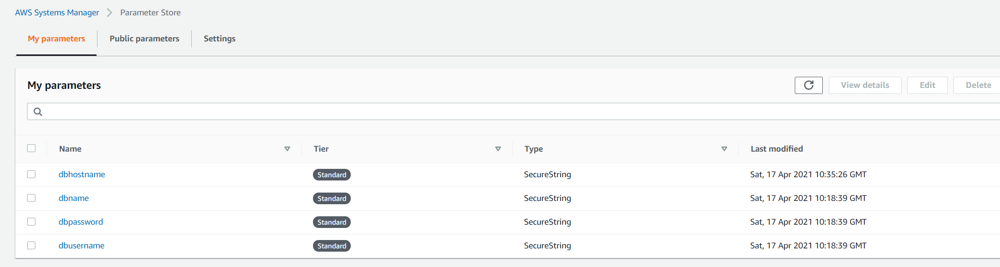

### **Create ECS Cluster, Launch & Auto Scaling Group Configuration and Deploy Dockerized Application on ECS Cluster**

An Amazon ECS cluster is a logical grouping of tasks or services. We are running both tasks and services that use the EC2 launch type. This section describes how the containerized application gets deployed on ECS EC2 instances (launch configuration registered ec2 instance in ECS cluster) managed by autoscaling group. Application image pushed to ECR in `build` stage is pulled during `terraform_deploy` stage, image tagging explained here in detail **[Image Tag](#image-tag)**. ECS tasks get the database values such as **(VTT_DBUSER, VTT_DBPASSWORD etc..)** from the SSM parameter store and it establishes the connection with multi-AZ RDS instance.The number of tasks running depend upon the desired_count set in service definition. Once the tasks start running on the ECS cluster, target group performs health check of the target endpoint (/healthcheck/) at port 3000 of ec2 instances and only after passing initial check instances get registered under target group. After receiving the successful response from the endpoint, ALB send the traffic to backend registered targets that are healthy.

### **Image Tag**

Task definition image version (`"image": "account-id.dkr.ecr.aws-region.amazonaws.com/ecr-repo:release-number"`) depend on  AWS account id, aws region, ecr-repo ciricle environmental variable and release number which is the same as the version value specified in `TechChallengeApp/cmd/root.go` the file.

- `aws_ecs_cluster.app_ecs_cluster`: This resource creates the ECS cluster.
- `aws_launch_configuration.ecs_launch_configuration`: This resource creates launch configuration for autoscaling group.
- `aws_autoscaling_group.ecs_autoscaling_group`: This resource create autoscaling group for EC2 instance running under ECS cluster.

```sh
#### ECS Cluster Name
resource "aws_ecs_cluster" "app_ecs_cluster" {
  name = var.ecs_cluster
  tags = {
    Name = "ECS Cluster Name"
  }
}

##### Launch Configuration

resource "aws_launch_configuration" "ecs_launch_configuration" {
  name                 = "ecs_launch_configuration"
  image_id             = var.ami_id
  instance_type        = "t2.micro"
  iam_instance_profile = aws_iam_instance_profile.ecs-instance-profile.id
  security_groups      = [aws_security_group.app_asg.id]
  root_block_device {
    volume_type           = "standard"
    volume_size           = 100
    delete_on_termination = true
  }

  lifecycle {
    create_before_destroy = true
  }
  user_data = <<EOF
                                  #!/bin/bash
                                  echo ECS_CLUSTER=ecs_cluster >> /etc/ecs/ecs.config
                                  EOF
}

##### Auto Scaling Group Configuration

resource "aws_autoscaling_group" "ecs_autoscaling_group" {
  depends_on           = ["aws_launch_configuration.ecs_launch_configuration", "aws_db_instance.app_db"]
  name                 = var.asg_name
  max_size             = var.max_instance_size
  min_size             = var.min_instance_size
  desired_capacity     = var.desired_capacity
  vpc_zone_identifier  = [aws_subnet.app_subnet_1.id, aws_subnet.app_subnet_2.id]
  launch_configuration = aws_launch_configuration.ecs_launch_configuration.name
  health_check_type    = "ELB"
  tag {
    key                 = "Name"
    value               = "APP ECS"
    propagate_at_launch = true
  }

}
```

### **Create Cloudwatch Alarm and Autoscaling Group Policies**

To scale up and scale down the autoscaling group, ECS tasks we need to set up autoscaling policies and respective alarms. Auto-scaling policy action (up/down) controlled by the cloudwatch alarm. To keep things simple I have ONLY used CPU metrics to trigger alarms for autoscaling of EC2 instance and tasks. AWS provides default CPU metrics (`CPUUtilization`) for EC2 instance under the namespace **AWS/EC2** and for ECS tasks it is available in namespace **AWS/ECS**. Here is the resource detail which terraform will create in order to scaling policy and alarms.

- `aws_cloudwatch_metric_alarm.ecs_service_scale_up_alarm`: This resource creates the cloudwatch scale-up alarm for ecs service to scale up the tasks if CPU usage is above the threshold limit.
- `aws_cloudwatch_metric_alarm.ecs_service_scale_down_alarm`: This resource creates the cloudwatch scale-down alarm for ecs service to scale down the tasks if CPU usage is below the threshold limit.
- `aws_appautoscaling_target.ecs_target`: This resource creates app autoscaling target. Auto Scaling is possible by a combination of the Amazon ECS, CloudWatch, and Application Auto Scaling APIs. Services are created and updated with Amazon ECS, alarms are created with CloudWatch, and scaling policies are created with Application Auto Scaling.
- `aws_appautoscaling_policy.scale_down`: This resource creates scale-down policy for tasks
- `aws_appautoscaling_policy.scale_up`: This resource creates scale-up policy for tasks
- `aws_cloudwatch_metric_alarm.app-asg-cpu-alarm-scaleup`: This resource creates the cloudwatch alarm to scale up the EC2 instance in autoscaling group and it triggers the scale up policy attached to ASG whenever CPU usage is above the threshold limit.
- `aws_cloudwatch_metric_alarm.app-asg-cpu-alarm-scaledown`: This resource creates the cloudwatch alarm to scale down the EC2 instance in autoscaling group and it triggers the scaling down policy attached to ASG whenever CPU usage is below the threshold limit.
- `aws_autoscaling_policy.cpu_agents_scale_up`: This resource creates the autoscaling policy which scale up the ASG by `app-asg-cpu-alarm-scaleup` alarm is triggered.
- `aws_autoscaling_policy.cpu_agents_scale_down`: This resource creates the autoscaling policy which scale down the ASG whenever `app-asg-cpu-alarm-scaledown` alarm is triggered.

```sh
#### CloudWatch Alarms #####

### High CPU usage metrics Alarm for ECS APP service
resource "aws_cloudwatch_metric_alarm" "ecs_service_scale_up_alarm" {
  alarm_name          = "ecs_cluster-appecsservice-ECSServiceScaleUpAlarm"
  depends_on          = ["aws_db_instance.app_db", "aws_appautoscaling_target.ecs_target", "aws_ecs_cluster.app_ecs_cluster"]
  comparison_operator = "GreaterThanOrEqualToThreshold"
  evaluation_periods  = var.evaluation_periods
  metric_name         = "CPUUtilization"
  namespace           = "AWS/ECS"
  period              = var.period_up
  statistic           = var.statistic
  threshold           = var.threshold_up
  datapoints_to_alarm = var.datapoints_to_alarm_up

  dimensions = {
    ClusterName = var.ecs_cluster
    ServiceName = var.service_name
  }

  alarm_description = "This alarm monitors ECS app service High CPU utilization"
  alarm_actions     = [aws_appautoscaling_policy.scale_up.arn]
  tags = {
    key   = "Name"
    value = "App Service High CPU Alarm"

  }
}

### Low CPU usage metrics Alarm for ECS APP service
resource "aws_cloudwatch_metric_alarm" "ecs_service_scale_down_alarm" {
  depends_on          = ["aws_db_instance.app_db", "aws_appautoscaling_target.ecs_target", "aws_ecs_cluster.app_ecs_cluster"]
  alarm_name          = "ecs_cluster-appecsservice-ECSServiceScaleDownAlarm"
  comparison_operator = "LessThanOrEqualToThreshold"
  evaluation_periods  = var.evaluation_periods
  metric_name         = "CPUUtilization"
  namespace           = "AWS/ECS"
  period              = var.period_down
  statistic           = var.statistic
  threshold           = var.threshold_down
  datapoints_to_alarm = var.datapoints_to_alarm_down

  dimensions = {
    ClusterName = var.ecs_cluster
    ServiceName = var.service_name
  }

  alarm_description = "This alarm monitors ECS app service Low CPU utilization"
  alarm_actions     = [aws_appautoscaling_policy.scale_down.arn]
  tags = {
    key   = "Name"
    value = "App Service Low CPU Alarm"

  }
}

#### Application AutoScaling Policy Target
resource "aws_appautoscaling_target" "ecs_target" {
  max_capacity       = var.max_capacity
  min_capacity       = var.min_capacity
  depends_on         = ["aws_ecs_service.app_ecs_service"]
  resource_id        = "service/ecs_cluster/appecsservice"
  role_arn           = aws_iam_role.ecs_autoscale_role.arn
  scalable_dimension = "ecs:service:DesiredCount"
  service_namespace  = "ecs"
}


#### Application AutoScaling Policy Resource
resource "aws_appautoscaling_policy" "scale_down" {
  name               = "ecs_cluster-appecsservice-scale-down"
  resource_id        = aws_appautoscaling_target.ecs_target.resource_id
  scalable_dimension = "ecs:service:DesiredCount"
  service_namespace  = "ecs"

  step_scaling_policy_configuration {
    adjustment_type         = "ChangeInCapacity"
    cooldown                = 60
    metric_aggregation_type = "Maximum"

    step_adjustment {
      metric_interval_upper_bound = var.upperbound
      scaling_adjustment          = var.scale_down_adjustment
    }
  }

  depends_on = [aws_appautoscaling_target.ecs_target]
}

#### Application AutoScaling Policy Resource
resource "aws_appautoscaling_policy" "scale_up" {
  name               = "ecs_cluster-appecsservice-scale-up"
  resource_id        = aws_appautoscaling_target.ecs_target.resource_id
  scalable_dimension = "ecs:service:DesiredCount"
  service_namespace  = "ecs"

  step_scaling_policy_configuration {
    adjustment_type         = "ChangeInCapacity"
    cooldown                = 60
    metric_aggregation_type = "Maximum"

    step_adjustment {
      metric_interval_lower_bound = var.lowerbound
      scaling_adjustment          = var.scale_up_adjustment
    }
  }

  depends_on = [aws_appautoscaling_target.ecs_target]
}

### APP ASG High CPU usage metrics Alarm
resource "aws_cloudwatch_metric_alarm" "app-asg-cpu-alarm-scaleup" {
  alarm_name          = "app-asg-cpu-alarm-scaleup"
  alarm_description   = "app-asg-cpu-alarm-scaleup"
  comparison_operator = "GreaterThanOrEqualToThreshold"
  evaluation_periods  = var.evaluation_periods
  metric_name         = "CPUUtilization"
  namespace           = "AWS/EC2"
  period              = var.period_up
  statistic           = var.statistic
  threshold           = var.threshold_up
  dimensions = {
    AutoScalingGroupName = aws_autoscaling_group.ecs_autoscaling_group.name
  }

  alarm_actions = [aws_autoscaling_policy.cpu_agents_scale_up.arn]
  tags = {
    key   = "Name"
    value = "APP ASG High CPU Usage Alarm"

  }
}

### APP ASG Low CPU usage metrics Alarm
resource "aws_cloudwatch_metric_alarm" "app-asg-cpu-alarm-scaledown" {
  alarm_name          = "app-asg-cpu-alarm-scaledown"
  alarm_description   = "app-asg-cpu-alarm-scaledown"
  comparison_operator = "LessThanOrEqualToThreshold"
  evaluation_periods  = var.evaluation_periods
  metric_name         = "CPUUtilization"
  namespace           = "AWS/EC2"
  period              = var.period_down
  statistic           = var.statistic
  threshold           = var.threshold_down

  dimensions = {
    AutoScalingGroupName = aws_autoscaling_group.ecs_autoscaling_group.name
  }

  alarm_actions = [aws_autoscaling_policy.cpu_agents_scale_down.arn]
  tags = {
    key   = "Name"
    value = "APP ASG Low CPU Usage Alarm"

  }
}

#### ASG Scale up policy
resource "aws_autoscaling_policy" "cpu_agents_scale_up" {
  name                   = "agents-scale-up"
  scaling_adjustment     = 1
  adjustment_type        = "ChangeInCapacity"
  cooldown               = 300
  autoscaling_group_name = aws_autoscaling_group.ecs_autoscaling_group.name
}

#### ASG Scale down policy
resource "aws_autoscaling_policy" "cpu_agents_scale_down" {
  name                   = "agents-scale-down"
  autoscaling_group_name = aws_autoscaling_group.ecs_autoscaling_group.name
  adjustment_type        = "ChangeInCapacity"
  scaling_adjustment     = "-1"
  cooldown               = "300"
  policy_type            = "SimpleScaling"
}
```

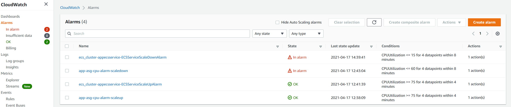

### **Create Application Load Balancer, Listener and Target group**

To access the application from internet we are going to create application load balancer and need to register the EC2 instances (running ECS tasks) under Target group. Once the instances registered and passes the health checks, application should be accessible via ALB dns name and should be able to forward all incoming requests at port 80 to backend instances on port 3000.

- `aws_alb.ecs_load_balancer`: This resource creates Application Load balancer (ALB).
- `aws_alb_target_group.ecs_target_group`: This resource creates Target Group.
- `aws_alb_listener.alb-listener`: This resource creates ALB listener.

```sh
##### Application Load balancer
resource "aws_alb" "ecs_load_balancer" {
  name            = "ecsloadbalancer"
  security_groups = [aws_security_group.lb_asg.id]
  subnets         = [aws_subnet.pub_subnet_1.id, aws_subnet.pub_subnet_2.id]
  tags = {
    Name = "APP ALB"
  }
}

##### ALB Target Group
resource "aws_alb_target_group" "ecs_target_group" {
  name     = "ecstargetgroup"
  port     = "3000"
  protocol = "HTTP"
  vpc_id   = aws_vpc.app_vpc.id

  health_check {
    healthy_threshold   = "5"
    unhealthy_threshold = "2"
    interval            = "30"
    matcher             = "200,202"
    path                = "/healthcheck/"
    port                = "3000"
    protocol            = "HTTP"
    timeout             = "5"
  }

  lifecycle {
    create_before_destroy = true
  }

  depends_on = [aws_alb.ecs_load_balancer]

  tags = {
    Name = "ECS Target Group"
  }
}

#### ALB Listener
resource "aws_alb_listener" "alb-listener" {
  load_balancer_arn = aws_alb.ecs_load_balancer.arn
  port              = "80"
  protocol          = "HTTP"

  default_action {
    target_group_arn = aws_alb_target_group.ecs_target_group.arn
    type             = "forward"
  }
}
```

### **Access Servian App and Tag the Release**

Once the circleci pipeline completes the first three stages we will have all the three tiers of infrastructure gets deployed on AWS. In the fourth stage (`app_status`) it performs the health check of ALB endpoint **(ALB DNS Name)** on the path /healthcheck/ as mentioned in the below example and only after getting the `OK` response the next stage and final stage (`release`) get triggered. In the fifth and final stage, it will create a release & tag it as per the version mentioned in the root.go file and last commit message.

```sh
curl ecsloadbalancer-1767216617.us-east-1.elb.amazonaws.com/healthcheck/
OK
```

To access the application from the web browser go to the AWS search bar on the top of AWS console and search for ec2 then click on load balancer option (available at the bottom of the left panel) and look for the dns name of `ecsloadbalancer` load balancer. Copy the DNS name as mentioned in the below screen and paste it on the web browser, you should be able to see the servian app up & running.

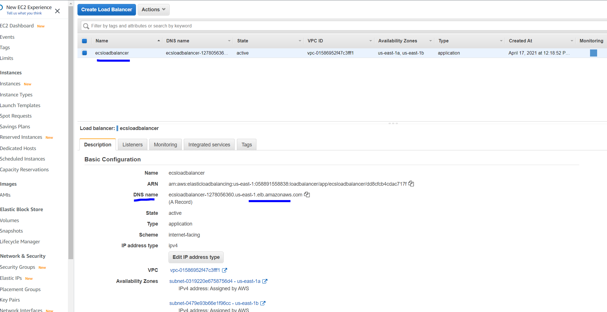

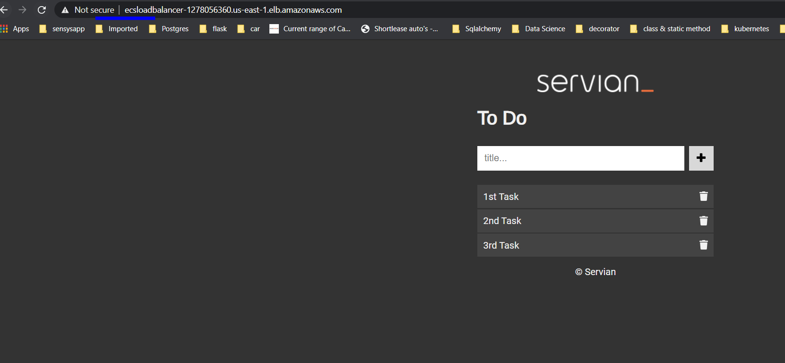

This is how the release will looks like in the repo:
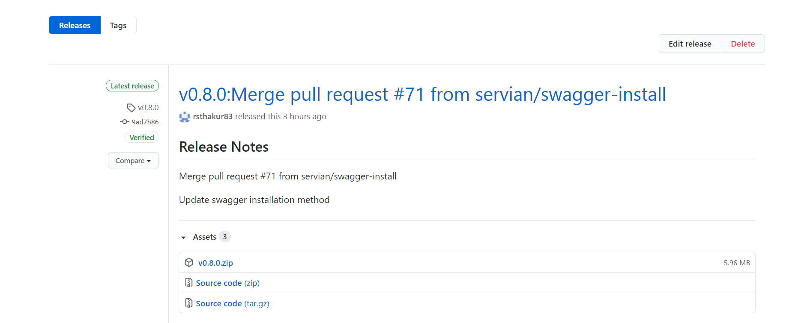

If we want to create release & pre-release in below format then simply remove `:${RELEASE_MESSAGE}` from below command `(line number 164 and 167)` in the CircleCI file `.circleci/config.yml`.

```sh
ghr -t ${GITHUB_TOKEN} -u ${CIRCLE_PROJECT_USERNAME} -r ${CIRCLE_PROJECT_REPONAME} -c ${CIRCLE_SHA1}  -delete  -n "v${RELEASE_NUMBER}"  -b "${BODY}"  v${RELEASE_NUMBER}  ./artifacts
```

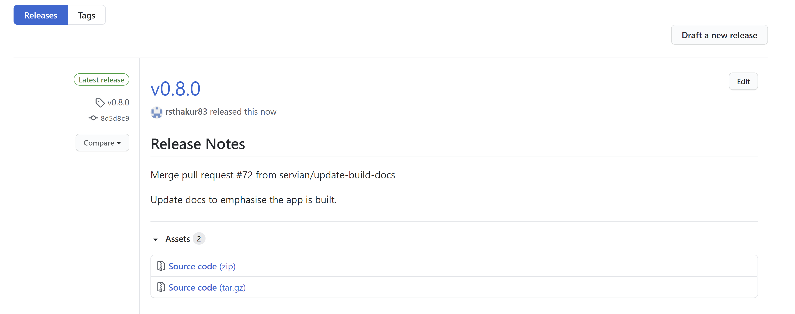

## **Application Rolling Update Deployment**

CircleCI pipeline gets triggered every time we have commit in the repo <https://github.com/servian/TechChallengeApp.git> master branch. And the latest changes get deployed as a new ECS task on the ECS cluster and will create a new release & tag on the master branch.

Below are the steps executed during the deployment of the new release.

- In the build stage we are creating new image and tag it as per the version mentioned in root.go file.
- Push the image to ECR repo
- Create new task definition
- Find the list of existing running tasks on the ECS cluster and delete the old tasks
- After deleting old task quickly update the service desired task count to 2 and execute the force deployment

Following is the script `deploy.sh` located under the path `app/deploy.sh` which allows the smooth-rolling update deployment of the new release.

```sh
#!/bin/bash

ECS_CLUSTER=`grep -A 1 "ECS cluster name" ../variable.tf |grep default|cut -d'"' -f 2`
SERVICE_NAME=`grep -A 1 "ECS App Service Name" ../variable.tf |grep default|cut -d'"' -f 2`
appsvc=`aws ecs describe-services --cluster $ECS_CLUSTER --service $SERVICE_NAME  --query 'services[*].[serviceName]' --output text`
git clone app-repo

if [ "$appsvc" = "$SERVICE_NAME" ];then
        repo="ecr-repo"
        AWS_REGION="aws-region"
        ECS_CLUSTER=`grep -A 1 "ECS cluster name" ../variable.tf |grep default|cut -d'"' -f 2`
        SERVICE_NAME=`grep -A 1 "ECS App Service Name" ../variable.tf |grep default|cut -d'"' -f 2`
        TASK_FAMILY=`grep -A 1 "ECS Task Family" ../variable.tf |grep default|cut -d'"' -f 2`

        export RELEASE_NUMBER="$(cat TechChallengeApp/cmd/root.go |grep Version|awk '{print $2}'|cut -d '"' -f2)"
        export AWS_ACCOUNT_ID="$(aws sts get-caller-identity --query Account --output text)"
        TASK_DEFINITION=`aws ecs describe-task-definition --task-definition $TASK_FAMILY --region $AWS_REGION`
        NEW_IMAGE="$AWS_ACCOUNT_ID.dkr.ecr.$AWS_REGION.amazonaws.com/$repo:$RELEASE_NUMBER"
        NEW_TASK_DEFINTIION=$(echo $TASK_DEFINITION | jq --arg IMAGE "$NEW_IMAGE" '.taskDefinition | .containerDefinitions[0].image = $IMAGE | del(.taskDefinitionArn) | del(.revision) | del(.status) | del(.requiresAttributes) | del(.compatibilities)')
        NEW_TASK_INFO=$(aws ecs register-task-definition --region "$AWS_REGION" --cli-input-json "$NEW_TASK_DEFINTIION")
        NEW_REVISION=$(echo $NEW_TASK_INFO | jq '.taskDefinition.revision')
        OLD_TASK_ID=`aws ecs list-tasks --cluster $ECS_CLUSTER --desired-status RUNNING --family $TASK_FAMILY | egrep "task/" | sed -E "s/.*task\/(.*)\"/\1/"`
        echo $NEW_REVISION
        TASK_REVISION=`aws ecs describe-task-definition --task-definition $TASK_FAMILY | egrep "revision" | tr "/" " " | awk '{print $2}' | sed 's/"$//'`
        CURRENT_REVISION_NUMBER=`echo $TASK_REVISION| cut -d ',' -f 1`
        FINAL_REVISION=$(($CURRENT_REVISION_NUMBER - 1))
        for old_task in $OLD_TASK_ID;do aws ecs --region $AWS_REGION  stop-task --cluster $ECS_CLUSTER --task $old_task;done
        aws ecs update-service --cluster ${ECS_CLUSTER} \
                       --service ${SERVICE_NAME} \
                       --task-definition ${TASK_FAMILY}:${NEW_REVISION} --desired-count 2 --force-new-deployment
        sleep 120
else
        cd ..;terraform init;terraform plan ;terraform apply --auto-approve;sleep 300
fi
```
